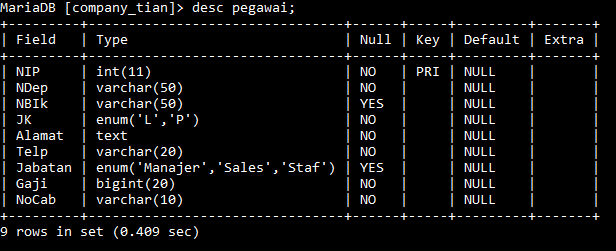
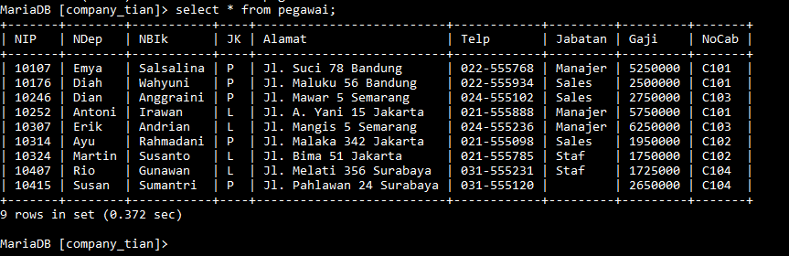

## 1. Gunakan perintah DESC pegawai; untuk mendapatkan struktur tabel.
Struktur:
~~~ SQL
 CREATE TABLE pegawai (
 -> NIP INT PRIMARY KEY,
 -> NDep VARCHAR(255) NOT NULL,
 -> NBlk VARCHAR(255),
 -> JK ENUM('L', 'P') NOT NULL,
 -> Alamat TEXT NOT NULL,
 -> Telp VARCHAR(255) NOT NULL,
Jabatan ENUM('Manager', 'Supervisor', 'Staff'),
    Gaji BIGINT NOT NULL,
    NoCab VARCHAR(255) NOT NULL
);
~~~

### Penjelasan:
- NIP INT PRIMARY KEY:
    - NIP: Kolom ini menyimpan Nomor Induk Pegawai yang bertipe data integer (INT).
    - PRIMARY KEY: Menandakan bahwa kolom NIP adalah kunci utama dari tabel ini. Kunci utama harus memiliki nilai yang unik untuk setiap baris dan tidak boleh NULL.
    
- NDep VARCHAR(255) NOT NULL:
    - NDep: Kolom ini menyimpan Nama Depan pegawai bertipe data string dengan panjang maksimum 255 karakter (VARCHAR(255)).
    - NOT NULL: Menandakan bahwa kolom ini tidak boleh berisi nilai kosong (NULL); artinya, setiap baris harus memiliki nilai untuk kolom ini.
    
- NBlk VARCHAR(255):
    - NBlk: Kolom ini menyimpan Nama Belakang pegawai bertipe data string dengan panjang maksimum 255 karakter (VARCHAR(255)).
    - Kolom ini tidak memiliki batasan NOT NULL, sehingga nilai kosong (NULL) diizinkan.
    
- JK ENUM('L', 'P') NOT NULL:
    - JK: Kolom ini menyimpan Jenis Kelamin pegawai dengan tipe data ENUM. Hanya dua nilai yang diperbolehkan: 'L' (Laki-laki) atau 'P' (Perempuan).
    - NOT NULL: Menandakan bahwa kolom ini tidak boleh kosong; artinya, setiap baris harus memiliki nilai untuk kolom ini.

- Alamat TEXT NOT NULL:
    - Alamat: Kolom ini menyimpan alamat pegawai dengan tipe data TEXT, yang bisa menampung teks dalam jumlah besar.
    - NOT NULL: Menandakan bahwa kolom ini harus diisi dengan nilai; nilai kosong (NULL) tidak diperbolehkan.

- Telp VARCHAR(255) NOT NULL:
    - Telp: Kolom ini menyimpan nomor telepon pegawai dengan tipe data string dan panjang maksimum 255 karakter (VARCHAR(255)).
    - NOT NULL: Menandakan bahwa kolom ini harus diisi; nilai kosong (NULL) tidak diperbolehkan.
    
- Jabatan ENUM('Manager', 'Supervisor', 'Staff'):
    - Jabatan: Kolom ini menyimpan jabatan pegawai dengan tipe data ENUM. Nilai yang diperbolehkan adalah 'Manager', 'Supervisor', atau 'Staff'.
    - Kolom ini tidak memiliki batasan NOT NULL, sehingga nilai kosong (NULL) diizinkan.
    
- Gaji BIGINT NOT NULL:
    - Gaji: Kolom ini menyimpan gaji pegawai dengan tipe data BIGINT, yang dapat menampung bilangan bulat yang sangat besar.
    - NOT NULL: Menandakan bahwa kolom ini harus diisi; nilai kosong (NULL) tidak diperbolehkan.
    
- NoCab VARCHAR(255) NOT NULL:
    - NoCab: Kolom ini menyimpan nomor cabang pegawai dengan tipe data string dan panjang maksimum 255 karakter (VARCHAR(255)).
    - NOT NULL: Menandakan bahwa kolom ini harus diisi; nilai kosong (NULL) tidak diperbolehkan.

Hasil:

## 2. Gunakan perintah SELECT * FROM pegawai; untuk mendapatkan data.
Struktur:
~~~ SQL
INSERT INTO pegawai (NIP, NDep, NBlk, JK, Alamat, Telp, Jabatan, Gaji, NoCab) VALUES 
-> (10107, 'Emya', 'Salsalina', 'P', 'JL. Suci 78 Bandung', '022-555768', 'Manager', 5250000, 'C101'), 
-> (10246, 'Dian', 'Anggraini', 'P', 'JL. Mawar 5 Semarang', '024-555102', 'Supervisor', 2750000, 'C103'), 
-> (10324, 'Martin', 'Susanto', 'L', 'JL. Bima 51 Jakarta', '021-555785', 'Staff', 1750000, 'C102'), 
-> (10252, 'Antoni', 'Irawan', 'L', 'JL. A. Yani 15 Jakarta', '021-555888', 'Manager', 5750000, 'C102'), 
-> (10176, 'Diah', 'Wahyuni', 'P', 'JL. Maluku 56 Bandung', '022-555934', 'Supervisor', 2500000, 'C101'), 
-> (10314, 'Ayu', 'Rahmadani', 'P', 'JL. Malaka 342 Jakarta', '021-555098', 'Supervisor', 1950000, 'C102'), 
-> (10307, 'Erik', 'Adrian', 'L', 'JL. Manggis 5 Semarang', '024-555236', 'Manager', 6250000,   'C103'), 
-> (10415, 'Susan', 'Sumantri', 'P', 'JL. Pahlawan 24 Surabaya', '031-555120', '', 2650000, 'C104'), 
-> (10407, 'Rio', 'Gunawan', 'L', 'JL. Melati 356 Surabaya', '031-555231', 'Staff', 1725000, 'C104')~~;
~~~

### Penjelasan:
- INSERT INTO pegawai:
    - Menunjukkan bahwa Anda akan menambahkan data ke tabel bernama pegawai.
    
- (NIP, NDep, NBlk, JK, Alamat, Telp, Jabatan, Gaji, NoCab):
    - Ini adalah daftar kolom dalam tabel pegawai yang akan diisi dengan data. Kolom-kolom ini adalah:
        - NIP (Nomor Induk Pegawai)
        - NDep (Nama Depan)
        - NBlk (Nama Belakang)
        - JK (Jenis Kelamin)
        - Alamat (Alamat)
        - Telp (Telepon)
        - Jabatan (Jabatan)
        - Gaji (Gaji)
        - NoCab (Nomor Cabang)
        
- VALUES:
    - Menunjukkan data yang akan dimasukkan ke dalam tabel. Data untuk setiap baris harus sesuai dengan urutan kolom yang disebutkan sebelumnya.
    
- Data yang Dimasukkan:
    - Baris pertama:
        - NIP: 10107
        - NDep: 'Emya'
        - NBlk: 'Salsalina'
        - JK: 'P' (Perempuan)
        - Alamat: 'JL. Suci 78 Bandung'
        - Telp: '022-555768'
        - Jabatan: 'Manager'
        - Gaji: 5250000
        - NoCab: 'C101'
    - Baris kedua dan seterusnya mengikuti pola yang sama, dengan data yang berbeda.
    
- Catatan:
    - Pada baris 10415 untuk Susan Sumantri, kolom Jabatan tidak diisi (''), yang bisa menyebabkan masalah jika kolom Jabatan adalah ENUM dan tidak termasuk nilai kosong. Pastikan kolom Jabatan memiliki nilai yang valid.
    - Jika ada nilai kosong ('') dalam kolom Jabatan, Anda mungkin ingin memperbarui baris ini dengan jabatan yang sesuai, seperti 'Staff', atau menyesuaikan schema tabel untuk mengizinkan nilai kosong jika perlu.

Hasil :

## 1
*penjelasan:* Perintah COUNT dalam MySQL digunakan untuk menghitung jumlah baris dalam suatu tabel yang memenuhi kriteria tertentu. Ini adalah fungsi agregat yang sangat umum digunakan dalam query SQL untuk memperoleh informasi statistik tentang data dalam tabel.

*Contoh:* 
~~~sql
SELECT COUNT(NIP) AS jumlahpegawai, COUNT(Jabatan) AS jumlahJabatan FROM pegawai;
~~~

*Hasil:*

*Analisis:*
- `SELECT` = untuk memilih kolom apa saja yang ingin dipilih (untuk dihitung).
- `COUNT(NIP)` = untuk menghitung jumlah barisan data yang mempunyai isi data dari kolom yang dipilih. NIP adalah nama kolom yang dipilih untuk dihitung.
- `AS` = untuk mengubah nama dari suatu kolom untuk sementara.
- `jumlahpegawai` = merupakan nama ubahan dari perintah AS yang digunakan. merupakan nama sementara dari perintah COUNT(NIP).
- `COUNT(Jabatan)` = untuk menghitung jumlah barisan data yang mempunyai isi data dari kolom yang dipilih. Jabatan adalah nama kolom yang dipilih untuk menghitung.
- `AS` = untuk mengubah nama dari suatu kolom untuk sementara
- `jumlahjabatan` =  merupakan nama ubahan dari perintah AS yang digunakan. merupakan nama sementara dari perintah COUNT(NIP).
- `FROM pegawai` = merupakan dari tabel mana datanya yang digunakan, pegawai adalah nama tabel yang datanya ingin digunakan.

## 2.
*penjelasan:* Queri SQL yang Anda berikan akan menghitung jumlah karyawan ( NIP) dalam pegawai`tabel yang termasuk dalam cabang atau departemen tertentu yang diidentifikasi oleh `NoCab = 'C102'.

*contoh:* 
~~~sql
SELECT COUNT(NIP) AS jumlahpegawai
-> FROM pegawai
-> WHERE NoCab = 'C102';
~~~

*hasil:*

*analisis:*
- `SELECT`= untuk memilih kolom mana saja yang di ingin dipilih untuk dihitung.
- `COUNT(NIP)`= untuk menghitung jumlah basis data yang mempunyai data dari kolom yang dipilih, NIP adalah nama kolom yang dipilih untuk dihitung.
- `AS`= untuk mengubah nama dari suatu kolom untuk sementara.
- `jumlahpegawai`= nama sementara yang dipilih untuk colom COUNT(NIP).
- `FROM pegawa`i= dari tabel mana datanya akan digunakan, pegawai adalah nama tabel yang dipilih untuk digunakan.
- WHERE= merupakan kondisi yang harus dipenuhi agar datanya dapat dihitung dengan query COUNT(NIP).
- (NoCab = C102;) = adalah kondisi dari WHERE yang harus dipenuhi, jadi hanya barisan data yang memiliki C102 dikolom NoCab yang bisa dihitung.

## 3.
*penjelasan:* SELECT NoCab, COUNT(NIP) AS jumlah_pegawai:

*contoh:*
~~~sql
SELECT NoCab,COUNT(NIP) AS jumlah_pegawai
    -> FROM pegawai
    -> GROUP BY NoCab;
~~~

*hasil:*

*analisis:*
- SELECT= untuk memilih kolom mana saja yang ingin dihitung atau ditampilkan.
- NoCab= merupakan nama kolom yang ingin ditampilkan.
- COUNT(NIP)= untuk menghitung jumlah barisan data yang mempunyai isi data dari kolom yang dipilih, NIP adalah nama kolom yang dipilih unutk dihitung
- AS= untuk mengubah nama dari suatu kolom untuk sementara.
- jumlah_pagawai= merupakan nama sementara dari kolom hasil COUNT(NIP).
- FROM pegawai= dari tabel mana yang data kolomnya ingin digunakan.
- GROUP BY= untuk mengelompokkan data berdasarkan nilai data yang telah ditentukan pada kolom yang dipilih.
- NoCab= nama kolom yang dipilih untuk datanya dikelompokkan.
 

## 4.
**GAMBAR : 

STRUKTUR :
~~~sql
SELECT NoCab, COUNT(NIP) AS Jumlah_pegawai
    -> FROM pegawai
    -> GROUP BY NoCab HAVING COUNT(NIP) >= 3;
~~~

PENJELASAN : 
- SELECT NoCab, COUNT(NIP) AS Jumlah_pegawai:
    - NoCab: Memilih kolom NoCab yang biasanya menunjukkan kode cabang tempat pegawai bekerja.
    - COUNT(NIP): Menghitung jumlah baris atau records berdasarkan kolom NIP. Karena NIP biasanya merupakan identifikasi unik untuk setiap pegawai, ini menghitung jumlah pegawai.
    - AS Jumlah_pegawai: Memberikan alias Jumlah_pegawai pada hasil hitungan ini, untuk memberi nama yang lebih deskriptif pada kolom hasil.
    
- FROM pegawai:
    - Menunjukkan bahwa data yang akan diambil berasal dari tabel pegawai.

- GROUP BY NoCab:
    - Mengelompokkan hasil berdasarkan nilai dalam kolom NoCab. Ini memastikan bahwa penghitungan COUNT(NIP) dilakukan secara terpisah untuk setiap cabang.
    
- HAVING COUNT(NIP) >= 3:
    - HAVING: Digunakan untuk menetapkan kondisi pada kelompok data setelah pengelompokan dilakukan. Berbeda dengan WHERE yang digunakan sebelum pengelompokan, HAVING berlaku setelah GROUP BY.
    - COUNT(NIP) >= 3: Menyaring kelompok cabang yang memiliki jumlah pegawai lebih dari atau sama dengan tiga. Hanya cabang-cabang yang memenuhi kondisi ini yang akan ditampilkan dalam hasil query.

## 5.
**GAMBAR : 

STRUKTUR :
~~~sql
SELECT SUM(Gaji) AS Total_Gaji
    -> FROM pegawai;
~~~

PENJELASAN : 
- SELECT SUM(Gaji) AS Total_Gaji:
    - SUM(Gaji): Menghitung jumlah total dari semua nilai dalam kolom Gaji. Fungsi agregat SUM() menjumlahkan nilai-nilai dalam kolom tersebut.
    - AS Total_Gaji: Memberikan alias Total_Gaji pada hasil hitungan ini. Alias ini akan digunakan sebagai nama kolom dalam hasil query.
    
- FROM pegawai:
    - Menunjukkan bahwa data yang akan diambil berasal dari tabel pegawai.

## 6.
**GAMBAR : 

STRUKTUR :
~~~sql
SELECT SUM(Gaji) AS Gaji_Manager
    -> FROM pegawai
    -> WHERE Jabatan = 'Manajer';
~~~

PENJELASAN : 
- SELECT SUM(Gaji) AS Gaji_Manager:
    - SUM(Gaji): Menghitung jumlah total dari nilai-nilai dalam kolom Gaji. Fungsi agregat SUM() digunakan untuk menjumlahkan semua nilai gaji yang memenuhi kondisi tertentu.
    - AS Gaji_Manager: Memberikan alias Gaji_Manager pada hasil hitungan ini. Alias ini akan digunakan sebagai nama kolom dalam hasil query, memberikan deskripsi yang jelas bahwa nilai tersebut adalah total gaji untuk jabatan 'Manager'.
    
- FROM pegawai:
    - Menunjukkan bahwa data yang akan diambil berasal dari tabel pegawai.
    
- WHERE Jabatan = 'Manager':
    - Menetapkan kondisi filter untuk query. Hanya baris yang memiliki nilai Jabatan sama dengan 'Manager' yang akan dihitung. Dengan kata lain, hanya pegawai dengan jabatan 'Manager' yang akan dihitung total gajinya.

## 7.
**GAMBAR : 

STRUKTUR :
~~~sql
SELECT NoCab, SUM(Gaji) AS TotalGaji
    -> FROM pegawai
    -> GROUP BY NoCab;
~~~

PENJELASAN : 
- SELECT NoCab, SUM(Gaji) AS TotalGaji:
    - NoCab: Memilih kolom NoCab, yang biasanya menunjukkan kode cabang tempat pegawai bekerja.
    - SUM(Gaji): Menghitung jumlah total dari nilai-nilai dalam kolom Gaji. Fungsi agregat SUM() digunakan untuk menjumlahkan gaji dari semua pegawai dalam setiap cabang.
    - AS TotalGaji: Memberikan alias TotalGaji pada hasil hitungan ini, yang akan digunakan sebagai nama kolom dalam hasil query.

- FROM pegawai:
    - Menunjukkan bahwa data yang akan diambil berasal dari tabel pegawai.

- GROUP BY NoCab:
    - Mengelompokkan hasil berdasarkan nilai dalam kolom NoCab. Ini memastikan bahwa perhitungan SUM(Gaji) dilakukan secara terpisah untuk setiap nilai unik di kolom NoCab, yaitu setiap cabang.

## 8.
**GAMBAR : 

STRUKTUR :
~~~sql
SELECT NoCab, SUM(Gaji) AS Total_Gaji
    -> FROM pegawai
    -> GROUP BY NoCab HAVING SUM(Gaji) >= 8000000;
~~~

PENJELASAN : 
- SELECT NoCab, SUM(Gaji) AS Total_Gaji:
    - NoCab: Memilih kolom NoCab, yang biasanya menunjukkan kode cabang tempat pegawai bekerja.
    - SUM(Gaji): Menghitung jumlah total dari nilai-nilai dalam kolom Gaji. Fungsi agregat SUM() digunakan untuk menjumlahkan gaji dari semua pegawai dalam setiap cabang.
    - AS Total_Gaji: Memberikan alias Total_Gaji pada hasil hitungan ini, yang akan digunakan sebagai nama kolom dalam hasil query.

- FROM pegawai:
    - Menunjukkan bahwa data yang akan diambil berasal dari tabel pegawai.

- GROUP BY NoCab:
    - Mengelompokkan hasil berdasarkan nilai dalam kolom NoCab. Ini memastikan bahwa perhitungan SUM(Gaji) dilakukan secara terpisah untuk setiap cabang.

- HAVING SUM(Gaji) >= 8000000:
    - HAVING: Digunakan untuk menetapkan kondisi pada kelompok data setelah pengelompokan dilakukan. Ini berbeda dari WHERE yang berlaku sebelum pengelompokan.
    - SUM(Gaji) >= 8000000: Menyaring hasil agar hanya cabang-cabang yang memiliki total gaji 8.000.000 atau lebih yang ditampilkan.

## 9.
**GAMBAR : 

STRUKTUR :
~~~sql
SELECT AVG(Gaji) AS Rata_rata
    -> FROM pegawai;
~~~

PENJELASAN : 
- SELECT AVG(Gaji) AS Rata_rata:
    - AVG(Gaji): Menghitung rata-rata dari nilai-nilai dalam kolom Gaji. Fungsi agregat AVG() digunakan untuk menghitung nilai rata-rata dari kolom tersebut.
    - AS Rata_rata: Memberikan alias Rata_rata pada hasil perhitungan ini. Alias ini akan digunakan sebagai nama kolom dalam hasil query, memberikan deskripsi yang jelas bahwa nilai tersebut adalah rata-rata gaji.
    
- FROM pegawai:
    - Menunjukkan bahwa data yang akan diambil berasal dari tabel pegawai.
## 10.
**GAMBAR : 

STRUKTUR :
~~~sql
SELECT AVG(Gaji) AS GajiRataMgr
    FROM pegawai
    WHERE Jabatan = 'Manajer';
~~~

PENJELASAN : 
- SELECT AVG(Gaji) AS GajiRataMgr:
    - AVG(Gaji): Menghitung rata-rata nilai dari kolom Gaji. Fungsi agregat AVG() digunakan untuk menghitung nilai rata-rata gaji.
    - AS GajiRataMgr: Memberikan alias GajiRataMgr pada hasil perhitungan ini. Alias ini akan digunakan sebagai nama kolom dalam hasil query, memberikan deskripsi yang jelas bahwa nilai tersebut adalah rata-rata gaji untuk jabatan 'Manager'.

- FROM pegawai:
    - Menunjukkan bahwa data yang akan diambil berasal dari tabel pegawai.

- WHERE Jabatan = 'Manager':
    - Menetapkan kondisi filter sehingga hanya pegawai yang memiliki nilai Jabatan sama dengan 'Manager' yang dihitung. Ini berarti hanya gaji dari pegawai dengan jabatan 'Manager' yang akan dimasukkan dalam perhitungan rata-rata.

## 11.
**GAMBAR : 

STRUKTUR :
~~~sql
SELECT NoCab, AVG(Gaji) AS RataGaji
    FROM pegawai
    GROUP BY NoCab;
~~~

PENJELASAN : 
- SELECT NoCab, AVG(Gaji) AS RataGaji:
    - SELECT: Digunakan untuk menentukan kolom mana yang ingin ditampilkan dalam hasil query.
    - NoCab: Kolom pertama yang akan ditampilkan dalam hasil query. Ini adalah kolom yang menunjukkan kode cabang (misalnya, NoCab bisa merujuk pada nomor cabang dari tabel pegawai).
    - AVG(Gaji) AS RataGaji: Menghitung rata-rata nilai kolom Gaji untuk setiap grup yang dikelompokkan (dalam hal ini, berdasarkan NoCab). Fungsi *AVG adalah fungsi agregat yang menghitung nilai rata-rata dari kolom yang ditentukan. AS RataGaji* memberikan alias atau nama lain pada kolom hasil perhitungan rata-rata tersebut, sehingga hasilnya akan ditampilkan dengan nama RataGaji.

- FROM pegawai:
    - Menunjukkan tabel dari mana data diambil, dalam hal ini tabel yang bernama pegawai.

- GROUP BY NoCab:
    - GROUP BY: Digunakan untuk mengelompokkan baris-baris yang memiliki nilai kolom yang sama. Dalam hal ini, data akan dikelompokkan berdasarkan kolom NoCab. Setiap grup berisi baris-baris dengan nilai NoCab yang sama.
    - Setelah pengelompokan, fungsi agregat (seperti AVG) diterapkan pada setiap grup.
## 12.
**GAMBAR : 

STRUKTUR :
~~~sql
SELECT NoCab, AVG(Gaji) AS RataGaji
    FROM pegawai
    GROUP BY NoCab HAVING NoCab = 'C101' OR NoCab = 'C102';
~~~

PENJELASAN : 
- SELECT NoCab, AVG(Gaji) AS RataGaji:
    - SELECT: Digunakan untuk menentukan kolom yang ingin ditampilkan dalam hasil query.
    - NoCab: Kolom pertama yang ditampilkan dalam hasil query, yang mewakili kode cabang.
    - AVG(Gaji) AS RataGaji: Fungsi agregat *AVG* digunakan untuk menghitung rata-rata nilai dari kolom Gaji untuk setiap grup yang dibentuk berdasarkan NoCab. Hasilnya diberi nama alias RataGaji.

- FROM pegawai:
    - Menunjukkan bahwa data diambil dari tabel pegawai.

- GROUP BY NoCab:
    - GROUP BY digunakan untuk mengelompokkan data berdasarkan nilai kolom NoCab. Setiap nilai unik dari NoCab akan menjadi satu grup, dan rata-rata gaji (AVG(Gaji)) dihitung untuk masing-masing grup.

- HAVING NoCab = 'C101' OR NoCab = 'C102':
    - HAVING adalah klausul yang digunakan untuk memfilter hasil setelah pengelompokan data dengan GROUP BY.
    - Dalam konteks ini, HAVING membatasi hasil query hanya pada grup-grup di mana NoCab adalah 'C101' atau 'C102'.
    - Ini berbeda dari WHERE karena WHERE digunakan sebelum pengelompokan, sedangkan HAVING digunakan setelah pengelompokan.
## 13.
**GAMBAR : 

STRUKTUR :
~~~sql
SELECT MAX(Gaji) AS GajiTerbesar, MIN(Gaji) AS GajiTerkecil
    FROM pegawai;
~~~

PENJELASAN : 
- SELECT MAX(Gaji) AS GajiTerbesar, MIN(Gaji) AS GajiTerkecil:
    - MAX(Gaji): Fungsi MAX digunakan untuk mencari nilai maksimum dari kolom Gaji. Fungsi ini akan menelusuri semua nilai dalam kolom Gaji dan mengembalikan nilai yang paling besar. Hasil dari fungsi ini akan diberi alias (nama lain) GajiTerbesar.
    - MIN(Gaji): Fungsi MIN digunakan untuk mencari nilai minimum dari kolom Gaji. Fungsi ini akan menelusuri semua nilai dalam kolom Gaji dan mengembalikan nilai yang paling kecil. Hasil dari fungsi ini akan diberi alias (nama lain) GajiTerkecil.

- FROM pegawai:
    - FROM pegawai: Bagian ini menentukan dari tabel mana data akan diambil. Dalam hal ini, data diambil dari tabel pegawai.
## 14.
**GAMBAR : 

STRUKTUR :
~~~sql
SELECT Max(Gaji) AS GajiTerbesar, MIN(Gaji) AS GajiTerkecil
    FROM pegawai
    WHERE jabatan = 'manajer';
~~~

PENJELASAN : 
- SELECT NoCab, Max(Gaji) AS GajiTerbesar, MIN(Gaji) AS GajiTerkecil:
    - NoCab: Kolom ini akan ditampilkan dalam hasil query untuk menunjukkan nomor cabang.
    - MAX(Gaji) AS GajiTerbesar: Fungsi MAX digunakan untuk mencari nilai maksimum dari kolom Gaji dalam setiap grup NoCab. Hasilnya diberi alias GajiTerbesar.
    - MIN(Gaji) AS GajiTerkecil: Fungsi MIN digunakan untuk mencari nilai minimum dari kolom Gaji dalam setiap grup NoCab. Hasilnya diberi alias GajiTerkecil.

- FROM pegawai:
    - Bagian ini menentukan dari tabel mana data akan diambil. Dalam hal ini, data diambil dari tabel pegawai.

- GROUP BY NoCab:
    - GROUP BY NoCab: Bagian ini mengelompokkan hasil berdasarkan kolom NoCab. Artinya, data akan dikelompokkan berdasarkan nomor cabang, dan untuk setiap cabang, fungsi MAX dan MIN akan diterapkan pada kolom Gaji.

## 15.
*hasil:*

*contoh:*
~~~sql
SELECT NoCab, MAX(Gaji) AS GajiTerbesar, MIN(Gaji) AS GajiTerkecil
    -> FROM pegawai
    -> GROUP BY NoCab;
~~~

*penjelasan:*
- SELECT NoCab: Ini memilih `NoCab`kolom untuk mengidentifikasi setiap cabang atau departemen.
- MAX(Gaji) AS GajiTerbesar: Ini menghitung gaji maksimum di setiap kelompok NoCab.
- MIN(Gaji) AS GajiTerkecil: Ini menghitung gaji minimum di setiap kelompok NoCab.
- FROM pegawai: Ini menentukan tabel ( pegawai) dari mana data akan dipilih.
- GROUP BY NoCab: Ini mengelompokkan hasil berdasarkan NoCab`kolom, artinya untuk setiap `NoCab, kueri akan mengembalikan gaji maksimum dan minimum.

## 16.
**GAMBAR : 

STRUKTUR :
~~~sql
SELECT NoCab, Max(Gaji) AS GajiTerbesar, MIN(Gaji) AS GajiTerkecil
    FROM pegawai
    GROUP BY NoCab HAVING COUNT(NIP) >= 3;
~~~

PENJELASAN : 
- SELECT NoCab, Max(Gaji) AS GajiTerbesar, MIN(Gaji) AS GajiTerkecil:
    - NoCab: Kolom ini menampilkan nomor cabang (NoCab) dalam hasil query.
    - MAX(Gaji) AS GajiTerbesar: Fungsi MAX digunakan untuk mencari nilai maksimum dari kolom Gaji dalam setiap grup NoCab. Hasilnya diberi alias GajiTerbesar.
    - MIN(Gaji) AS GajiTerkecil: Fungsi MIN digunakan untuk mencari nilai minimum dari kolom Gaji dalam setiap grup NoCab. Hasilnya diberi alias GajiTerkecil.

- FROM pegawai:
    - Bagian ini menentukan dari tabel mana data akan diambil. Dalam hal ini, data diambil dari tabel pegawai.

- GROUP BY NoCab:
    - GROUP BY NoCab: Bagian ini mengelompokkan hasil berdasarkan kolom NoCab. Artinya, data akan dikelompokkan berdasarkan nomor cabang, dan untuk setiap cabang, fungsi MAX dan MIN akan diterapkan pada kolom Gaji.

- HAVING COUNT(NIP) >= 3:
    - HAVING COUNT(NIP) >= 3: Kondisi ini menyaring hasil grup yang memenuhi kriteria tertentu. Dalam hal ini, hanya cabang yang memiliki jumlah pegawai (dihitung berdasarkan NIP, yang merupakan Nomor Induk Pegawai) sebanyak tiga atau lebih yang akan dimasukkan dalam hasil.
## 17.
**GAMBAR : 

STRUKTUR :
~~~sql
SELECT COUNT(NIP) AS JumlahPegawai, SUM(Gaji) AS TotalGaji,
    AVG(Gaji) AS RataGaji, MAX(Gaji) AS GajiMaks, MIN(Gaji) AS GajiMin
    FROM pegawai;
~~~

PENJELASAN : 
- SELECT COUNT(NIP) AS JumlahPegawai:
    - Bagian ini menghitung jumlah pegawai dalam tabel pegawai dengan cara menghitung berapa banyak data NIP (Nomor Induk Pegawai) yang ada. Hasilnya akan ditampilkan dengan nama alias JumlahPegawai.

- SUM(Gaji) AS TotalGaji:
    - Bagian ini menjumlahkan seluruh nilai gaji dari semua pegawai yang ada di tabel pegawai. Hasil penjumlahan ini akan ditampilkan dengan nama alias TotalGaji.

- AVG(Gaji) AS RataGaji:
    - Bagian ini menghitung rata-rata gaji dari semua pegawai yang ada di tabel pegawai. Hasil perhitungan rata-rata gaji ini akan ditampilkan dengan nama alias RataGaji.

- MAX(Gaji) AS GajiMaks:
    - Bagian ini mencari dan menampilkan gaji tertinggi (maksimum) di antara semua pegawai yang ada di tabel pegawai. Hasilnya akan ditampilkan dengan nama alias GajiMaks.

- MIN(Gaji) AS GajiMin:
    - Bagian ini mencari dan menampilkan gaji terendah (minimum) di antara semua pegawai yang ada di tabel pegawai. Hasilnya akan ditampilkan dengan nama alias GajiMin.

- FROM pegawai:
    - Bagian ini menunjukkan tabel sumber data yang digunakan, yaitu tabel pegawai. Semua operasi perhitungan (COUNT, SUM, AVG, MAX, MIN) akan dilakukan berdasarkan data yang ada di tabel ini.
## 18.
**GAMBAR : 

STRUKTUR :
~~~sql
SELECT COUNT(NIP) AS Jumlahpegawai, SUM(Gaji) AS TotalGaji,
    AVG(Gaji) AS RataGaji, Max(Gaji) AS GajiMks, MIN(Gaji) AS GajiMin
    FROM pegawai
    WHERE Jabatan = 'Staff' OR Jabatan = 'Sales'
    GROUP BY NoCab HAVING SUM(Gaji) <= 2600000;
~~~

PENJELASAN : 
- SELECT COUNT(NIP) AS Jumlahpegawai:
    - Bagian ini menghitung jumlah pegawai dengan menghitung jumlah NIP (Nomor Induk Pegawai) yang ada. Hasilnya akan ditampilkan dengan nama alias Jumlahpegawai.

- SUM(Gaji) AS TotalGaji:
    - Bagian ini menjumlahkan semua nilai gaji dari pegawai yang memenuhi kriteria. Hasil penjumlahan gaji ini akan ditampilkan dengan nama alias TotalGaji.

- AVG(Gaji) AS RataGaji:
    - Bagian ini menghitung rata-rata gaji dari pegawai yang memenuhi kriteria. Hasil perhitungan rata-rata ini akan ditampilkan dengan nama alias RataGaji.
- MAX(Gaji) AS GajiMks:
    - Bagian ini mencari dan menampilkan gaji tertinggi (maksimum) di antara pegawai yang memenuhi kriteria. Hasilnya akan ditampilkan dengan nama alias GajiMks.

- MIN(Gaji) AS GajiMin:
    - Bagian ini mencari dan menampilkan gaji terendah (minimum) di antara pegawai yang memenuhi kriteria. Hasilnya akan ditampilkan dengan nama alias GajiMin.

- FROM pegawai:
    - Bagian ini menunjukkan tabel yang menjadi sumber data, yaitu tabel pegawai.

- WHERE Jabatan = 'Staff' OR Jabatan = 'Sales':
    - Bagian ini menetapkan kondisi untuk memilih hanya pegawai dengan Jabatan yang bernilai 'Staff' atau 'Sales'. Artinya, hanya data pegawai dengan jabatan ini yang akan diproses lebih lanjut dalam query ini.

- GROUP BY NoCab:
    - Bagian ini mengelompokkan data berdasarkan kolom NoCab (Nomor Cabang). Artinya, data akan dikelompokkan per cabang, dan hasil perhitungan (jumlah pegawai, total gaji, rata-rata gaji, gaji tertinggi, dan gaji terendah) akan ditampilkan untuk setiap cabang.

- HAVING SUM(Gaji) <= 2600000:
    - Bagian ini menetapkan kondisi setelah pengelompokan, yaitu hanya cabang-cabang yang memiliki total gaji kurang dari atau sama dengan 2.600.000 yang akan ditampilkan dalam hasil akhir query. Kondisi ini digunakan setelah pengelompokan karena HAVING digunakan untuk menyaring hasil setelah agregasi (seperti SUM).